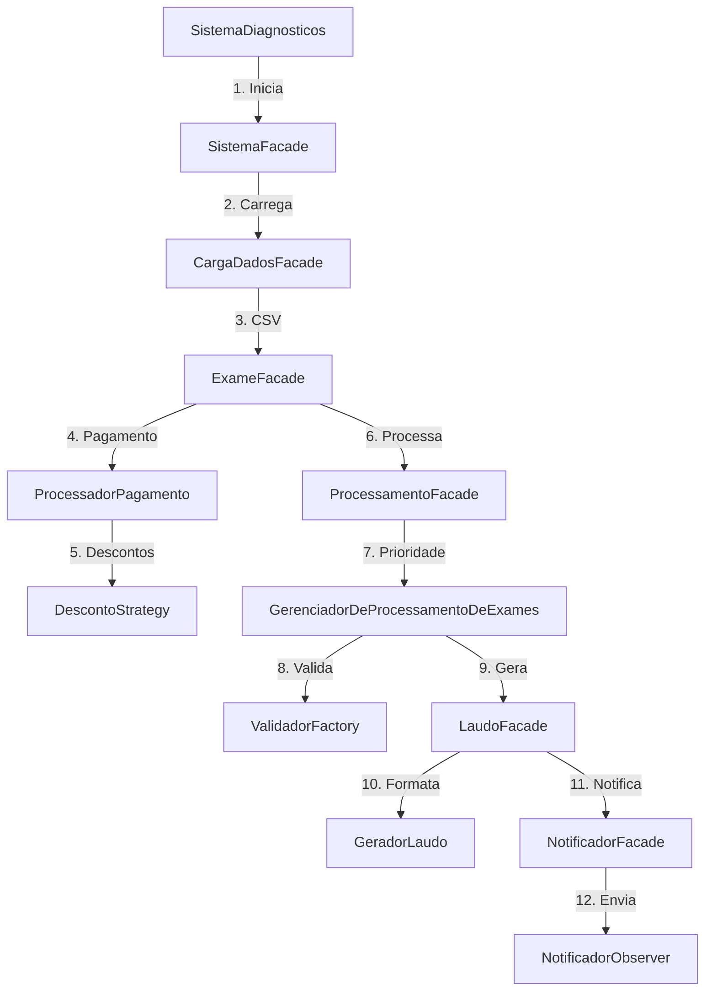

# ST Diagnósticos

Sistema completo para gerenciamento de exames médicos, incluindo agendamento, processamento, pagamento, geração de laudos e envio de notificações automáticas.

## Funcionalidades

* Agendamento de exames médicos com diferentes tipos (Hemograma, Ressonância).
* Processamento de exames com controle de estados (Solicitado, Processando, Concluído, Cancelado).
* Validação específica por tipo de exame com regras especializadas.
* Sistema de descontos flexível (convênio, idade, combinações).
* Geração de laudos em múltiplos formatos (Texto, HTML, PDF).
* Notificações automáticas para pacientes (Email, Telegram).
* Processamento prioritário de exames baseado em urgência.
* Carga de dados a partir de arquivos CSV.

## Arquitetura

O sistema adota uma arquitetura modular baseada em padrões de projeto, organizada em camadas bem definidas.

Camadas principais:

* **Core**: Coordenação do fluxo principal através de fachadas.
* **Model**: Entidades de domínio (Paciente, Médico, Exame).
* **Factories**: Criação de objetos complexos.
* **Validators**: Validação de regras de negócio.
* **Payments**: Processamento de pagamentos e descontos.
* **Reports**: Geração e formatação de laudos.
* **Notifier**: Sistema de notificações.
* **States**: Controle do ciclo de vida dos exames.

## Classes e Responsabilidades

### Sistema

* **SistemaDiagnosticos**: Classe principal, contém o método `main`.
* **SistemaFacade**: Fachada que centraliza o fluxo (agendamento, processamento, pagamento, laudo, notificação).
* **ExameFacade**, **LaudoFacade**, **NotificadorFacade**, **ProcessamentoFacade**, **CargaDadosFacade**: Fachadas especializadas.

### Exames

* **Exame (abstract)**: Classe base que contém informações do exame, paciente, médico e estado.
* **Hemograma, Ressonancia**: Subclasses de `Exame`, especializações com atributos próprios.
* **FabricaExame (interface)**: Define contrato para criação de exames.
* **FabricaHemograma, FabricaRessonancia**: Implementações concretas.
* **ExameFactoryRegistry**: Registro de fábricas disponíveis.

### Validação

* **ValidadorExame (interface)**: Contrato para validadores.
* **ValidadorHemograma, ValidadorRessonancia**: Implementações específicas.
* **ValidadorFactory**: Cria instâncias de validadores corretos para cada exame.

### Pagamento

* **ProcessadorPagamento**: Realiza processamento financeiro.
* **DescontoStrategy (interface)**: Define cálculo de descontos.
* **DescontoConvenio, DescontoIdoso, DescontoComposto**: Estratégias concretas.

### Laudos

* **GeradorLaudo**: Orquestra a criação dos laudos.
* **LaudoTemplate (abstract)**: Estrutura base de laudo (cabeçalho, corpo, rodapé).
* **LaudoTexto, LaudoHtml, LaudoPdf**: Diferentes implementações.
* **DecoradorLaudo (abstract)**: Classe base para adicionar comportamento.
* **DecoradorCarimbo, DecoradorRodapeConfidencial**: Decoradores adicionais.
* **LaudoFactory, LaudoFactoryRegistry**: Criação e registro de templates.

### Processamento de Exames

* **GerenciadorDeProcessamentoDeExames**: Gerencia fila de exames e mudanças de estado com base em prioridade.
* **StatusExameState (interface)**: Define transições possíveis.
* **ExameSolicitado, ExameProcessando, ExameConcluido, ExameCancelado**: Estados concretos.

### Notificações

* **NotificadorObserver (interface)**: Observadores de eventos do sistema.
* **NotificadorEmail, NotificadorTelegram**: Implementações concretas.

### Usuários

* **Paciente**: Contém dados pessoais, exames e informações de convênio.
* **Medico**: Responsável por solicitar exames.

## Relações Entre Classes

| Classe Fonte                       | Relacionada a                                                          | Tipo de Relação |
| ---------------------------------- | ---------------------------------------------------------------------- | --------------- |
| SistemaDiagnosticos                | SistemaFacade                                                          | Composição      |
| SistemaFacade                      | Fábricas, Validadores, Pagamento, Laudos, Processamento, Notificadores | Coordenação     |
| Exame                              | Paciente, Medico, StatusExameState, LaudoTemplate                      | Agregação       |
| FabricaExame                       | FabricaHemograma, FabricaRessonancia                                   | Herança         |
| ValidadorFactory                   | ValidadorExame                                                         | Criação         |
| ProcessadorPagamento               | DescontoStrategy                                                       | Strategy        |
| LaudoTemplate                      | LaudoTexto, LaudoHtml, LaudoPdf                                        | Template Method |
| LaudoTemplate                      | DecoradorLaudo                                                         | Decorator       |
| GerenciadorDeProcessamentoDeExames | NotificadorObserver                                                    | Observer        |
| NotificadorObserver                | NotificadorEmail, NotificadorTelegram                                  | Implementação   |

## Fluxo do Sistema


```mermaid
flowchart TD
classDiagram
    %% =========================
    %% SISTEMA PRINCIPAL
    %% =========================
    class SistemaDiagnosticos {
        +main(args: String[]): void
    }

    class SistemaFacade {
      -carga: CargaDadosFacade
      -exameFacade: ExameFacade
      -procFacade: ProcessamentoFacade
      -notificadores: NotificadorFacade
      -laudoFacade: LaudoFacade
      +executarFluxo(caminhoCsv: String): void
      -processarExame(exameProcessado: Exame): void
    }
    %% =========================
    %% FACHADAS ESPECIALIZADAS
    %% =========================

    class CargaDadosFacade {
      -exameFacade: ExameFacade
      +carregarDados(caminhoCsv: String): List~Exame~
    }
    class ExameFacade {
        +agendarExame(tipoExame: String, codigo: String, valorBase: double, dataSolicitacao: Date, prioridade: Prioridade, paciente: Paciente, medico: Medico): Exame
        +pagarExame(exame: Exame): void
    }
    class LaudoFacade {
        -notificadores: NotificadorFacade
        +gerarLaudo(exame: Exame, formato: String, printConsole: boolean): String
    }
    class NotificadorFacade {
        -notificadores: List~NotificadorObserver~
        +notificarPaciente(exame: Exame, caminhoLaudo: String): void
        +adicionarNotificador(notificador: NotificadorObserver): void
    }
    class ProcessamentoFacade {
        -gerenciador: GerenciadorDeProcessamentoDeExames
        +enfileirarExame(exame: Exame): void
        +adicionarNotificadorGenerico(): void
        +processarExames(callback: Consumer~Exame~): void
        +getGerenciador(): GerenciadorDeProcessamentoDeExames
    }

    %% =========================
    %% ENTIDADES
    %% =========================
    class Paciente {
      -nome: String
      -cpf: String
      -dataNascimento: Date
      -email: String
      -sexo: Sexo
      -faixaEtaria: FaixaEtaria
      -temConvenio: boolean
      -exames: List~Exame~
      +getIdade(): int
      +adicionarExame(exame: Exame): void
      +getConvenio(): boolean
    }

    class Medico {
      -nome: String
      -CRM: String
      +solicitarExame(paciente: Paciente, tipoExame: String, fabrica: FabricaExame): Exame
    }


    %% =========================
    %% EXAMES E ESTADOS
    %% =========================
    class Exame {
      <<abstract>>
      -codigo: String
      -valorBase: double
      -dataSolicitacao: Date
      -prioridade: Prioridade
      -paciente: Paciente
      -medico: Medico
      -estado: StatusExameState
      -caminhoLaudo: String
      +getCodigo(): String
      +getValorBase(): double
      +getDataSolicitacao(): Date
      +getPrioridade(): Prioridade
      +getPaciente(): Paciente
      +getMedico(): Medico
      +getCaminhoLaudo(): String
      +getEstado(): StatusExameState
      +setEstado(estado: StatusExameState): void
      +avancarEstado(): void
      +cancelarExame(): void
    }
    %% =========================
    %% ENUMERAÇÕES
    %% =========================
  
    class Prioridade {
      <<enumeration>>
      +ALTA
      +MEDIA
      +BAIXA
    }

    class Sexo {
      <<enumeration>>
      +MASCULINO
      +FEMININO
    }
    class FaixaEtaria {
      <<enumeration>>
      +CRIANCA
      +ADULTO
      +IDOSO
    }

    class StatusExameState {
      <<interface>>
      +mudarEstadoExame(exame: Exame): void
      +cancelarExame(exame: Exame): void
    }

    class ExameSolicitado { 
      +mudarEstadoExame(exame: Exame): void
      +cancelarExame(exame: Exame): void 
      }
    class ExameProcessando { 
      +mudarEstadoExame(exame: Exame): void
      +cancelarExame(exame: Exame): void
      }
    class ExameConcluido { 
      +mudarEstadoExame(exame: Exame): void
      +cancelarExame(exame: Exame): void
      }
    class ExameCancelado { 
      +mudarEstadoExame(exame: Exame): void
      +cancelarExame(exame: Exame): void
      }

    class Hemograma {
      -hemoglobina: Double
      -leucocitos: Double
      -hematocrito: Double
      -plaquetas: Double
      +getHemoglobina(): Double
      +setHemoglobina(hemoglobina: Double): void
      +getLeucocitos(): Double
      +setLeucocitos(leucocitos: Double): void
      +getHematocrito(): Double
      +setHematocrito(hematocrito: Double): void
      +getPlaquetas(): Double
      +setPlaquetas(plaquetas: Double): void
    }

    class Ressonancia {
      -areaCorpo: String
      -comContraste: boolean
      +getAreaCorpo(): String
      +setAreaCorpo(areaCorpo: String): void
      +getComContraste(): boolean
      +setComContraste(comContraste: boolean): void
    }

    %% =========================
    %% FACTORY
    %% =========================
    class FabricaExame {
      <<interface>>
      +criarExame(codigo: String, valorBase: double, dataSolicitacao: Date, prioridade: Prioridade, paciente: Paciente, medico: Medico): Exame
    }

    class FabricaHemograma { 
      +criarExame(codigo: String, valorBase: double, dataSolicitacao: Date, prioridade: Prioridade, paciente: Paciente, medico: Medico): Exame 
    }
    class FabricaRessonancia { 
      +criarExame(codigo: String, valorBase: double, dataSolicitacao: Date, prioridade: Prioridade, paciente: Paciente, medico: Medico): Exame
    }

    class ExameFactoryRegistry {
      -registry: Map~String, FabricaExame~
      +registerFactory(key: String, factory: FabricaExame): void
      +getFactory(key: String): FabricaExame
    }

    %% =========================
    %% VALIDADORES
    %% =========================
    class ValidadorExame {
        <<interface>>
        +validar(exame: Exame): List~String~
    }
    class ValidadorBase {
        <<abstract>>
        +validarExameBase(exame: Exame): List~String~
    }
    class ValidadorHemograma {
        +validar(exame: Exame): List~String~
        +getStatusHemoglobina(valor: double, sexo: Sexo): String
        +getStatusLeucocitos(valor: double): String
        +getStatusHematocrito(valor: double, sexo: Sexo): String
        +getStatusPlaquetas(valor: double): String
    }
    class ValidadorRessonancia {
        -areasValidas: List~String~
        +validar(exame: Exame): List~String~
    }
    class ValidadorFactory {
       +criarValidador(exame: Exame): ValidadorExame 
    }

    %% =========================
    %% PAGAMENTO (STRATEGY)
    %% =========================
    class ProcessadorPagamento {
      -exame: Exame
      -descontoStrategy: DescontoStrategy
      -custoFinal: double
      +calcularCusto(): double
      +processarPagamento(): void
      +getCustoFinal(): double
      +setDescontoStrategy(estrategia: DescontoStrategy): void
    }

    class DescontoStrategy {
        <<interface>>
        +aplicarDesconto(valor: double): double
    }

    class DescontoConvenio {
        -PORCENTAGEM: double = 0.15
        +aplicarDesconto(valor: double): double
    }

    class DescontoIdoso {
        -PORCENTAGEM: double = 0.08
        +aplicarDesconto(valor: double): double
    }
    class DescontoComposto {
      -descontos: List~DescontoStrategy~
      +aplicarDesconto(valor: double): double
    }

    %% =========================
    %% LAUDOS (TEMPLATE METHOD)
    %% =========================
    class GeradorLaudo {
     -template: LaudoTemplate
      +gerar(cabecalho: String, corpo: String, rodape: String, nomeArquivo: String, printConsole: boolean): String
    }

    class LaudoTemplate {
      <<interface>>
      +gerarConteudo(cabecalho: String, corpo: String, rodape: String): String
      +salvarEmArquivo(conteudo: String, nomeArquivo: String): String
      +gerar(cabecalho: String, corpo: String, rodape: String, nomeArquivo: String, printConsole: boolean): String
    }

    class LaudoTexto {
      +gerarConteudo(cabecalho: String, corpo: String, rodape: String): String
      +salvarEmArquivo(conteudo: String, nomeArquivo: String): String
    }
    class LaudoHtml {
      +gerarConteudo(cabecalho: String, corpo: String, rodape: String): String
      +salvarEmArquivo(conteudo: String, nomeArquivo: String): String 
    }
    class LaudoPdf {
      +gerarConteudo(cabecalho: String, corpo: String, rodape: String): String
      +salvarEmArquivo(conteudo: String, nomeArquivo: String): String
    }
    class LaudoFactoryRegistry {
      -registry: Map~String, LaudoTemplate~
      +getTemplate(key: String): LaudoTemplate
      +registerTemplate(key: String, template: LaudoTemplate): void
    }
    %% =========================
    %% LAUDOS ESPECÍFICOS
    %% =========================
    class Laudo {
        <<interface>>
        +gerarCorpo(exame: Exame): String
    }
    class LaudoHemograma {
        -template: LaudoTemplate
        +gerarCorpo(exame: Exame): String
    }
    class LaudoRessonancia {
        -template: LaudoTemplate
        +gerarCorpo(exame: Exame): String
    }
    class LaudoFactory {
        +criarLaudo(exame: Exame, template: LaudoTemplate): Laudo
    }

    %% =========================
    %% DECORATOR DE LAUDOS
    %% =========================
    class DecoradorLaudo {
        <<abstract>>
      +DecoradorLaudo(laudo: LaudoTemplate)
      +gerarConteudo(cabecalho: String, corpo: String, rodape: String): String
      +salvarEmArquivo(conteudo: String, nomeArquivo: String): String
    }

    class DecoradorCarimbo {
      +gerarConteudo(cabecalho: String, corpo: String, rodape: String): String
    }
    class DecoradorRodapeConfidencial {
      +gerarConteudo(cabecalho: String, corpo: String, rodape: String): String
    }

    %% =========================
    %% OBSERVER (NOTIFICAÇÕES)
    %% =========================
    class NotificadorObserver {
        <<interface>>
        +atualizar(exame: Exame, caminhoLaudo: String): void
    }

    class NotificadorEmail {
        +atualizar(exame: Exame, caminhoLaudo: String): void
        -enviarEmail(destinatario: String, assunto: String, corpo: String, caminhoAnexo: String): void
    }
    class NotificadorTelegram {
        -chatId: String
        +atualizar(exame: Exame, caminhoLaudo: String): void
        -enviarMensagem(chatId: String, mensagem: String): void
    }

    %% =========================
    %% GERENCIADOR DE EXAMES
    %% =========================
    class GerenciadorDeProcessamentoDeExames {
        -filaExames: PriorityQueue~Exame~
        -notificadores: List~NotificadorObserver~
        +adicionarExame(exame: Exame): void
        +processarProximoExame(): Exame
        +notificarLaudoPronto(exame: Exame, caminhoLaudo: String): void
        +adicionarNotificador(notificador: NotificadorObserver): void
        +getNotificadores(): List~NotificadorObserver~
    }

    %% =========================
    %% RELACIONAMENTOS
    %% =========================
    SistemaDiagnosticos --> SistemaFacade
    SistemaFacade --> CargaDadosFacade
    SistemaFacade --> ExameFacade
    SistemaFacade --> ProcessamentoFacade
    SistemaFacade --> NotificadorFacade
    SistemaFacade --> LaudoFacade

    GerenciadorDeProcessamentoDeExames --> Exame
    GerenciadorDeProcessamentoDeExames --> NotificadorObserver
    ProcessamentoFacade --> GerenciadorDeProcessamentoDeExames

    ValidadorFactory --> ValidadorExame
    ValidadorExame <|.. ValidadorHemograma
    ValidadorExame <|.. ValidadorRessonancia
    ValidadorBase <|-- ValidadorHemograma
    ValidadorBase <|-- ValidadorRessonancia
    ProcessamentoFacade --> ValidadorFactory
    ValidadorHemograma ..> Hemograma
    ValidadorRessonancia ..> Ressonancia
    ValidadorRessonancia --> FaixaEtaria
    ValidadorHemograma --> Sexo

    ProcessadorPagamento --> Exame
    ProcessadorPagamento --> DescontoStrategy

    Laudo <|.. LaudoHemograma
    Laudo <|.. LaudoRessonancia
    LaudoFactory --> Laudo
    LaudoFactory --> LaudoTemplate
    LaudoHemograma --> LaudoTemplate
    LaudoRessonancia --> LaudoTemplate
    LaudoFacade --> LaudoFactory
    LaudoFacade --> Laudo

    GeradorLaudo --> LaudoTemplate
    LaudoTemplate <|-- LaudoTexto
    LaudoTemplate <|-- LaudoHtml
    LaudoTemplate <|-- LaudoPdf
    LaudoFacade --> LaudoFactoryRegistry
    LaudoFactoryRegistry --> LaudoTemplate
    LaudoFacade --> GeradorLaudo
    LaudoTemplate <|-- DecoradorLaudo

    DecoradorLaudo <|-- DecoradorCarimbo
    DecoradorLaudo o-- LaudoTemplate
    DecoradorLaudo <|-- DecoradorRodapeConfidencial
    LaudoFacade --> DecoradorCarimbo

    Exame --> StatusExameState
    Exame <|-- Hemograma
    Exame <|-- Ressonancia
    Exame --> Prioridade
    Exame --> LaudoTemplate

    Paciente --> Sexo
    Paciente --> FaixaEtaria

    StatusExameState <|.. ExameSolicitado
    StatusExameState <|.. ExameProcessando
    StatusExameState <|.. ExameConcluido
    StatusExameState <|.. ExameCancelado

    Paciente "1" *-- "*" Exame
    Medico "1" -- "*" Exame

    FabricaExame <|.. FabricaHemograma
    FabricaExame <|.. FabricaRessonancia
    ExameFacade --> ExameFactoryRegistry
    ExameFactoryRegistry --> FabricaExame

    DescontoStrategy <|.. DescontoConvenio
    DescontoStrategy <|.. DescontoIdoso
    DescontoStrategy <|.. DescontoComposto
    ExameFacade --> ProcessadorPagamento
    ProcessadorPagamento --> Exame
    ProcessadorPagamento --> DescontoStrategy

    NotificadorObserver <|.. NotificadorEmail
    NotificadorObserver <|.. NotificadorTelegram
    NotificadorFacade --> NotificadorObserver
    NotificadorObserver --> Exame
```

## Padrões de Projeto Utilizados

**1. Facade (`SistemaFacade`)**
* Coordena o fluxo principal do sistema.
* Fachadas especializadas para cada módulo.

**2. Abstract Factory (`FabricaExame`)**
* Criação de famílias de exames.
* Registro dinâmico via `ExameFactoryRegistry`.

**3. State (`StatusExameState`)**
* Ciclo de vida do exame: `Solicitado → Processando → Concluído `.

**4. Strategy (`DescontoStrategy`)**
* Regras intercambiáveis de desconto:
  * `DescontoConvenio`
  * `DescontoIdoso`
  * `DescontoComposto`

**5. Template Method (`LaudoTemplate`)**
* Estrutura fixa de laudos.
* Implementações: `Texto`, `HTML`, `PDF`.

**6. Decorator (`DecoradorLaudo`)**
* Adiciona funcionalidades aos laudos.
* Ex: `Carimbo`, `Rodapé Confidencial`.

**7. Observer (`NotificadorObserver`)**
* Notificações automáticas para pacientes.
* Implementações: `Email`, `Telegram`.

**8. Priority Queue (`GerenciadorDeProcessamentoDeExames`)**
* Processamento baseado em urgência:
  * **ALTA** → prioridade máxima
  * **MÉDIA** → intermediária
  * **BAIXA** → menor prioridade

## Estrutura do Projeto

```plaintext
src/
├── core/
│   ├── SistemaDiagnosticos.java
│   ├── SistemaFacade.java
│   ├── ExameFacade.java
│   ├── LaudoFacade.java
│   ├── NotificadorFacade.java
│   ├── ProcessamentoFacade.java
│   └── CargaDadosFacade.java
├── model/
│   ├── Paciente.java
│   ├── Medico.java
│   └── exame/
│       ├── Exame.java
│       ├── Hemograma.java
│       └── Ressonancia.java
├── factories/
│   ├── FabricaExame.java
│   ├── FabricaHemograma.java
│   ├── FabricaRessonancia.java
│   └── ExameFactoryRegistry.java
├── validators/
│   ├── ValidadorFactory.java
│   ├── ValidadorExame.java
│   ├── ValidadorHemograma.java
│   └── ValidadorRessonancia.java
├── payments/
│   ├── ProcessadorPagamento.java
│   ├── DescontoStrategy.java
│   ├── DescontoConvenio.java
│   ├── DescontoIdoso.java
│   └── DescontoComposto.java
├── states/
│   ├── StatusExameState.java
│   ├── ExameSolicitado.java
│   ├── ExameProcessando.java
│   ├── ExameConcluido.java
│   └── ExameCancelado.java
├── reports/
│   ├── GeradorLaudo.java
```
---

---
## **Como Executar**

Pré-requisitos
Java JDK 11 ou superior

Biblioteca Jakarta Mail (para notificações por email)

1. Clone o repositório:

    ```bash
    git clone https://github.com/seu-usuario/st-diagnosticos.git
    cd st-diagnosticos
    ```
    
2. Compile o projeto:

    ```bash
    javac -d bin -cp "src" src/core/SistemaDiagnosticos.java
    ```
    
3.Execute a aplicação:

    ```bash
    java -cp "bin" core.SistemaDiagnosticos
    ```
4.  Use o menu interativo para:

   * Agendar exames
   * Processar fila
   * Pagar com desconto
   * Gerar laudos
   * Receber notificações

---

## **Benefícios do Sistema**

* **Escalável** → novos exames, laudos, descontos e notificadores podem ser adicionados facilmente.
* **Flexível** → padrões permitem customizações sem alterar código existente.
* **Organizado** → responsabilidades bem separadas entre camadas.
* **Manutenível** → cada funcionalidade encapsulada em sua própria classe.

---

## **Dev**

* **Tecnologias**: Java, Padrões de Projeto
* **Licença**: [MIT](LICENSE)
