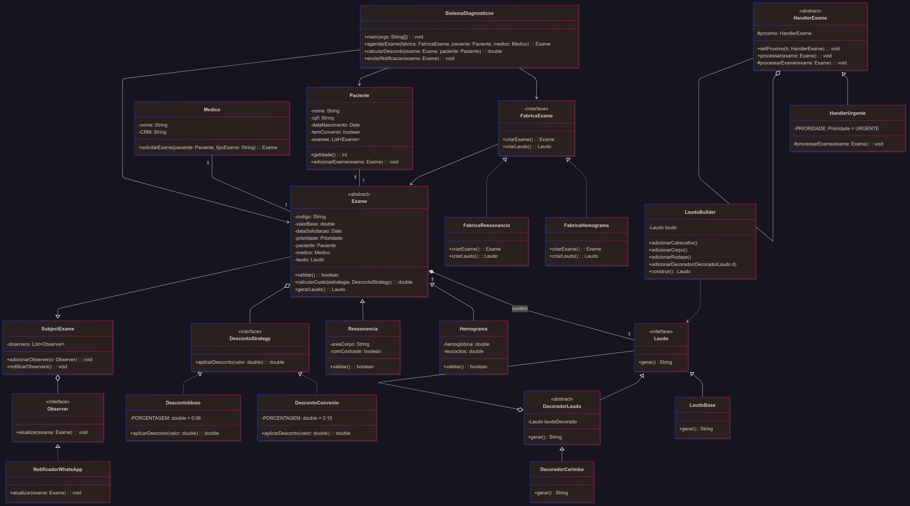

# README - Explicação dos Padrões de Projeto

# Visão Geral
Este projeto implementa um sistema de gerenciamento de exames médicos para a IF Diagnósticos, utilizando vários padrões de projeto para atender aos requisitos especificados. O sistema permite a emissão de laudos em diferentes formatos, aplicação de descontos dinâmicos, notificação de pacientes e priorização de exames.

# README - Padrões de Projeto no Sistema de Exames Médicos

## 1. Strategy (Para formatos de laudo)
**Problema Resolvido:** 
- Necessidade de gerar laudos em múltiplos formatos (texto, HTML, PDF) com possibilidade de adicionar novos formatos no futuro sem modificar o código existente (Requisito R4).

**Implementação:**
- Interface `FormatoLaudo` define o contrato para geração de laudos
- Classes concretas `PDFLaudoStrategy`, `HTMLLaudoStrategy` e `TextoLaudoStrategy` implementam a geração em cada formato
- Contexto `Laudo` mantém referência à estratégia atual e delega a geração

## 2. Abstract Factory (Para criação de exames)
**Problema Resolvido:**
- Criação de diferentes tipos de exames (Hemograma, Ressonância) com seus laudos correspondentes, permitindo adicionar novos exames sem alterar código existente (Requisito R3).

**Implementação:**
- Interface `ExameFactory` declara métodos para criar exames e laudos
- Fábricas concretas `HemogramaFactory`, `RessonanciaFactory` implementam a criação dos objetos específicos
- Cliente usa apenas a interface abstrata, sem depender de implementações concretas

## 3. Observer (Para notificações)
**Problema Resolvido:**
- Notificação automática de pacientes quando um laudo é emitido, com suporte a múltiplos canais (WhatsApp, e-mail) e extensível para novos canais (Requisito R6).

**Implementação:**
- Sujeito `Laudo` mantém lista de `Observer` registrados
- Classes concretas `WhatsAppNotifier`, `EmailNotifier` implementam notificação por diferentes canais
- Quando um laudo é emitido, notifica todos os observers registrados

## 4. Decorator (Para descontos)
**Problema Resolvido:**
- Aplicação de descontos dinâmicos (convênio, idoso, campanhas) sobre o preço base dos exames, permitindo combinar descontos (Requisito R7).

**Implementação:**
- Componente `Exame` define interface comum
- `ExameBase` implementa o comportamento básico
- Decoradores `DescontoConvenio`, `DescontoIdoso` adicionam funcionalidades de desconto
- Decoradores envolvem o componente original e modificam o cálculo do preço

## 5. Chain of Responsibility (Para validações)
**Problema Resolvido:**
- Validação específica para cada tipo de exame, com regras particulares para cada um (Requisito R5).

**Implementação:**
- Interface `ValidadorHandler` define o contrato para processamento
- Handlers concretos `ValidadorHemograma`, `ValidadorRessonancia` implementam regras específicas
- Cada handler decide se processa a requisição ou passa para o próximo na cadeia

## 6. Priority Queue (Para fila de exames)
**Problema Resolvido:**
- Priorização de exames conforme gravidade (URGENTE, POUCO URGENTE, ROTINA) (Requisito R8).

**Implementação:**
- `FilaPrioridadeExames` gerencia a ordem de processamento
- Classes `ExameUrgente`, `ExamePoucoUrgente`, `ExameRotina` implementam a lógica de prioridade
- Examina são ordenados automaticamente conforme sua prioridade

## 7. Template Method (Para estrutura de laudos)
**Problema Resolvido:**
- Estrutura comum para todos os laudos (cabeçalho, corpo, rodapé) com variações específicas por tipo de exame.

**Implementação:**
- Classe abstrata `LaudoTemplate` define o esqueleto do algoritmo
- Métodos abstratos `gerarCabecalho()`, `gerarCorpo()`, `gerarRodape()` são implementados por subclasses
- Subclasses concretas `HemogramaLaudo`, `RessonanciaLaudo` fornecem implementações específicas

## 8. State (Para status do exame)
**Problema Resolvido:**
- Controle do ciclo de vida dos exames (Pendente, Processando, Finalizado) com comportamentos distintos em cada estado.

**Implementação:**
- Interface `StatusExame` define os métodos comuns
- Classes concretas `StatusPendente`, `StatusProcessando`, `StatusFinalizado` implementam comportamentos específicos
- Contexto `Exame` delega comportamento para o objeto estado atual.
