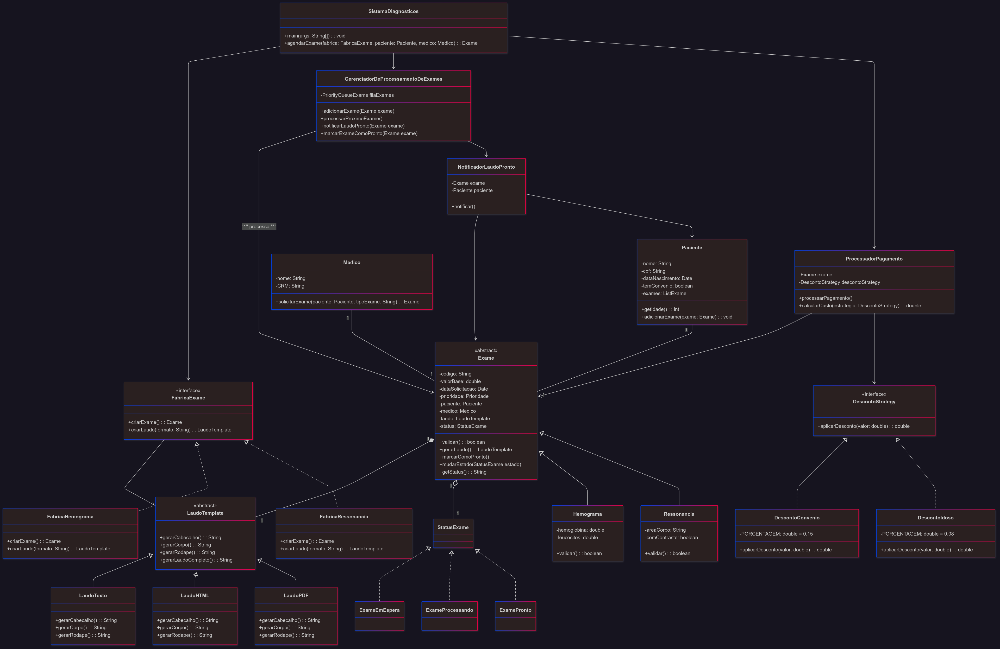
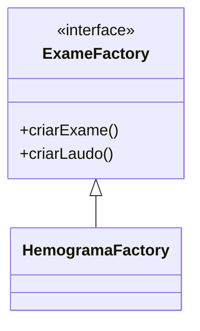

# README - Sistema de Gerenciamento de Exames Medicos - IF Diagnosticos

## Visao Geral
Sistema completo para gestao de exames medicos que implementa 8 padroes de projeto para:
- Emissao de laudos em multiplos formatos
- Aplicacao de descontos dinamicos
- Notificacao automatizada de pacientes
- Priorizacao inteligente de exames



## Padroes Implementados

### 1. Strategy (Formatacao de Laudos)
**Problema**: Gerar laudos em diferentes formatos (PDF/HTML/Texto)
**Solucao**:
```java
laudo.setStrategy(new PDFGenerator());
String conteudo = laudo.gerar();
```
**Beneficios**:
- Adicionar novos formatos sem alterar codigo existente
- Cumpre Requisito R4

### 2. Abstract Factory (Criacao de Exames)
**Problema**: Criar familias de objetos relacionados (exame + laudo)
**Diagrama**:

**Vantagens**:
- Isolamento das regras de criacao
- Suporta Requisito R3 (novos tipos de exames)

### 3. Observer (Notificacoes)
**Problema**: Notificar pacientes quando laudos ficam prontos
**Fluxo**:
1. Exame finaliza e chama notifyObservers()
2. Observadores sao ordenados por prioridade
3. Notificacoes sao enviadas (WhatsApp > Email)

### 4. Decorator (Descontos)
**Problema**: Aplicar descontos cumulativos
**Implementacao**:
```java
Exame exame = new ExameBase(200.0);
exame = new DescontoConvenio(exame); // 15%
exame = new DescontoIdoso(exame);    // +8%
double valorFinal = exame.getPreco();
```

### 5. Chain of Responsibility (Validacoes)
**Problema**: Validar exames com regras especificas
**Estrutura**:
```
ValidadorHemograma -> ValidadorRessonancia -> ValidadorTomografia
```
Cada validador processa ou repassa o exame

### 6. Template Method (Estrutura de Laudos)
**Problema**: Garantir estrutura padrao para laudos
**Esqueleto**:
```java
abstract class LaudoTemplate {
    final void gerarLaudo() {
        cabecalho();
        corpo();
        rodape();
    }
    abstract void corpo();
}
```

### 7. State (Status do Exame)
**Problema**: Gerenciar transicoes de estado
**Estados**:
- Pendente
- Processando
- Finalizado
- Cancelado

### 8. Priority Queue (Fila de Exames)
**Problema**: Processar exames por prioridade
**Ordem**:
1. Urgente
2. Prioritario
3. Rotina

## Estrutura do Projeto
```
src/
├── factories/       # Padrao Abstract Factory
├── strategies/      # Strategy para formatos
├── observers/       # Sistema de notificacao
├── decorators/      # Implementacao de descontos
└── templates/       # Template Method para laudos
```

## Requisitos Atendidos
| Padrao            | Requisitos |
|-------------------|------------|
| Abstract Factory  | R3         |
| Strategy          | R4         |
| Observer          | R6         |
| Decorator         | R7         |
| Chain of Resp.    | R5         |
| Template Method   | R9         |
