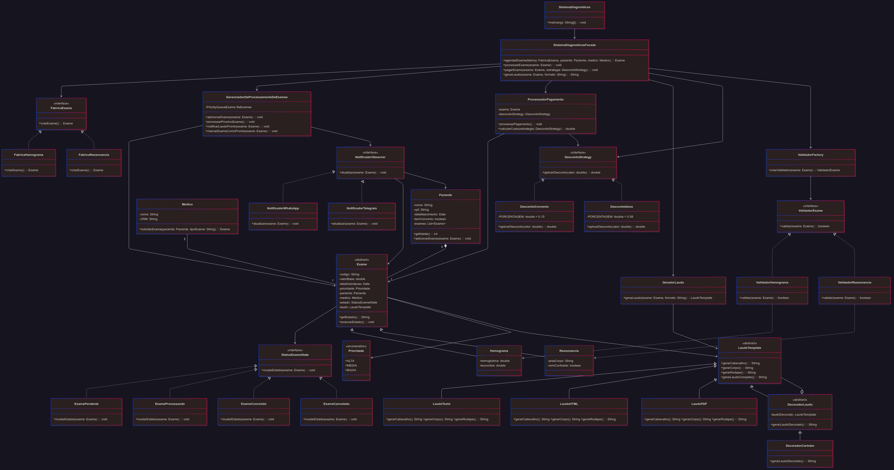
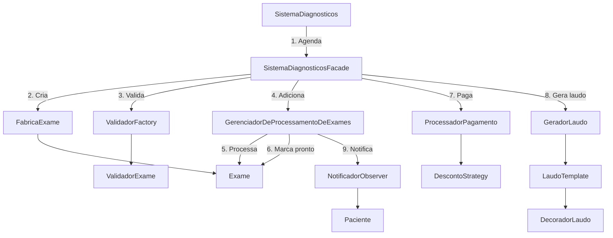

# ST Diagnósticos

Sistema para gerenciamento de exames médicos, incluindo agendamento, processamento, pagamento, geração de laudos e envio de notificações automáticas.


## Funcionalidades

* Agendamento de exames médicos.
* Processamento de exames com controle de estados.
* Validação específica por tipo de exame.
* Estratégias de desconto (convênio, idade, etc.).
* Geração de laudos em múltiplos formatos (Texto, HTML, PDF).
* Notificações automáticas para pacientes (WhatsApp, Telegram).

## Arquitetura

O sistema adota uma arquitetura modular e orientada a objetos, organizada em torno da fachada (`SistemaDiagnosticosFacade`), que centraliza a comunicação entre módulos.

Camadas principais:

* **Interface de Entrada**: Ponto inicial do sistema (`SistemaDiagnosticos`).
* **Gerenciamento de Exames**: Agendamento, estados e processamento.
* **Validação**: Verificação de regras específicas por tipo de exame.
* **Pagamento**: Aplicação de estratégias de desconto.
* **Laudos**: Geração e decoração de laudos médicos.
* **Notificação**: Envio de mensagens automatizadas.


## Classes e Responsabilidades

### Sistema

* **SistemaDiagnosticos**: Classe principal, contém o método `main`.
* **SistemaDiagnosticosFacade**: Fachada que centraliza o fluxo (agendamento, processamento, pagamento, laudo, notificação).

### Exames

* **Exame (abstract)**: Classe base que contém informações do exame, paciente, médico e estado.
* **Hemograma, Ressonancia**: Subclasses de `Exame`, especializações com atributos próprios.
* **FabricaExame (interface)**: Define contrato para criação de exames.
* **FabricaHemograma, FabricaRessonancia**: Implementações concretas.

### Validação

* **ValidadorExame (interface)**: Contrato para validadores.
* **ValidadorHemograma, ValidadorRessonancia**: Implementações específicas.
* **ValidadorFactory**: Cria instâncias de validadores corretos para cada exame.

### Pagamento

* **ProcessadorPagamento**: Realiza processamento financeiro.
* **DescontoStrategy (interface)**: Define cálculo de descontos.
* **DescontoConvenio, DescontoIdoso**: Estratégias concretas.

### Laudos

* **GeradorLaudo**: Orquestra a criação dos laudos.
* **LaudoTemplate (abstract)**: Estrutura base de laudo (cabeçalho, corpo, rodapé).
* **LaudoTexto, LaudoHTML, LaudoPDF**: Diferentes implementações.
* **DecoradorLaudo (abstract)**: Classe base para adicionar comportamento.
* **DecoradorCarimbo**: Adiciona carimbo a laudos.

### Processamento de Exames

* **GerenciadorDeProcessamentoDeExames**: Gerencia fila de exames e mudanças de estado.
* **StatusExameState (interface)**: Define transições possíveis.
* **ExamePendente, ExameProcessando, ExameConcluido, ExameCancelado**: Estados concretos.

### Notificações

* **NotificadorObserver (interface)**: Observadores de eventos do sistema.
* **NotificadorWhatsApp, NotificadorTelegram**: Implementações concretas.

### Usuários

* **Paciente**: Contém dados pessoais, exames e informações de convênio.
* **Medico**: Responsável por solicitar exames.

## Relações Entre Classes

| Classe Fonte                       | Relacionada a                                                          | Tipo de Relação |
| ---------------------------------- | ---------------------------------------------------------------------- | --------------- |
| SistemaDiagnosticos                | SistemaDiagnosticosFacade                                              | Composição      |
| SistemaDiagnosticosFacade          | Fábricas, Validadores, Pagamento, Laudos, Processamento, Notificadores | Coordenação     |
| Exame                              | Paciente, Medico, StatusExameState, LaudoTemplate                      | Agregação       |
| FabricaExame                       | FabricaHemograma, FabricaRessonancia                                   | Herança         |
| ValidadorFactory                   | ValidadorExame                                                         | Criação         |
| ProcessadorPagamento               | DescontoStrategy                                                       | Strategy        |
| LaudoTemplate                      | LaudoTexto, LaudoHTML, LaudoPDF                                        | Template Method |
| LaudoTemplate                      | DecoradorLaudo                                                         | Decorator       |
| GerenciadorDeProcessamentoDeExames | NotificadorObserver                                                    | Observer        |
| NotificadorObserver                | NotificadorWhatsApp, NotificadorTelegram                               | Implementação   |


---
## **Fluxo do Sistema**



---

## **Padrões de Projeto Utilizados**

### **1. Facade (`SistemaDiagnosticosFacade`)**

* Simplifica o acesso a funcionalidades complexas (agendar, validar, pagar, gerar laudo).
* Cliente interage apenas com a fachada, não com subsistemas diretamente.

---

### **2. Abstract Factory (`FabricaExame`)**

* Cria famílias de exames (`Hemograma`, `Ressonância`) de forma consistente.
* Cada exame tem seu próprio **validador especializado**.

---

### **3. State (`StatusExameState`)**

* Define o ciclo de vida do exame: `Pendente → Processando → Concluído → Cancelado`.
* Evita lógica condicional extensa dentro de `Exame`.

---

### **4. Strategy (`DescontoStrategy`)**

* Permite escolher diferentes regras de desconto no pagamento.
* Implementações:

  * `DescontoConvenio` (15%)
  * `DescontoIdoso` (8%)

---

### **5. Template Method (`LaudoTemplate`)**

* Estrutura fixa do laudo: `Cabeçalho + Corpo + Rodapé`.
* Implementações concretas: `LaudoTexto`, `LaudoHTML`, `LaudoPDF`.

---

### **6. Decorator (`DecoradorLaudo`)**

* Permite enriquecer laudos sem modificar classes originais.
* Exemplo: `DecoradorCarimbo` adiciona assinatura/carimbo oficial.

---

### **7. Observer (`NotificadorObserver`)**

* Pacientes são notificados automaticamente quando o laudo está pronto.
* Implementações: `NotificadorWhatsApp`, `NotificadorTelegram`.

---

### **8. Priority Queue (`GerenciadorDeProcessamentoDeExames`)**

* Exames são processados por prioridade:

  * **ALTA** → Atendidos primeiro
  * **MÉDIA** → Processamento intermediário
  * **BAIXA** → Últimos na fila

---

## **Estrutura do Projeto**

```plaintext
src/
├── core/
│   ├── SistemaDiagnosticos.java
│   └── SistemaDiagnosticosFacade.java
├── model/
│   ├── Paciente.java
│   ├── Medico.java
│   └── Exame.java
├── factories/
│   ├── FabricaExame.java
│   ├── FabricaHemograma.java
│   └── FabricaRessonancia.java
├── validators/
│   ├── ValidadorFactory.java
│   ├── ValidadorExame.java
│   ├── ValidadorHemograma.java
│   └── ValidadorRessonancia.java
├── payments/
│   ├── ProcessadorPagamento.java
│   ├── DescontoStrategy.java
│   ├── DescontoConvenio.java
│   └── DescontoIdoso.java
├── states/
│   ├── StatusExameState.java
│   ├── ExamePendente.java
│   ├── ExameProcessando.java
│   ├── ExameConcluido.java
│   └── ExameCancelado.java
├── reports/
│   ├── GeradorLaudo.java
│   ├── LaudoTemplate.java
│   ├── LaudoTexto.java
│   ├── LaudoHTML.java
│   ├── LaudoPDF.java
│   └── decorators/
│       ├── DecoradorLaudo.java
│       └── DecoradorCarimbo.java
├── observers/
│   ├── NotificadorObserver.java
│   ├── NotificadorWhatsApp.java
│   └── NotificadorTelegram.java
└── manager/
    └── GerenciadorDeProcessamentoDeExames.java
```
---

## **Como Executar**

1. Clone o repositório:

   ```bash
   git clone https://github.com/usuario/sistema-diagnosticos.git
   cd sistema-diagnosticos
   ```
2. Compile e execute a classe principal:

   ```bash
   javac src/core/SistemaDiagnosticos.java
   java core.SistemaDiagnosticos
   ```
3. Use o menu interativo para:

   * Agendar exames
   * Processar fila
   * Pagar com desconto
   * Gerar laudos
   * Receber notificações

---

## **Benefícios do Sistema**

* **Escalável** → novos exames, laudos, descontos e notificadores podem ser adicionados facilmente.
* **Flexível** → padrões permitem customizações sem alterar código existente.
* **Organizado** → responsabilidades bem separadas entre camadas.
* **Manutenível** → cada funcionalidade encapsulada em sua própria classe.

---

## **Dev**

* **Tecnologias**: Java, Padrões de Projeto
* **Licença**: [MIT](LICENSE)

