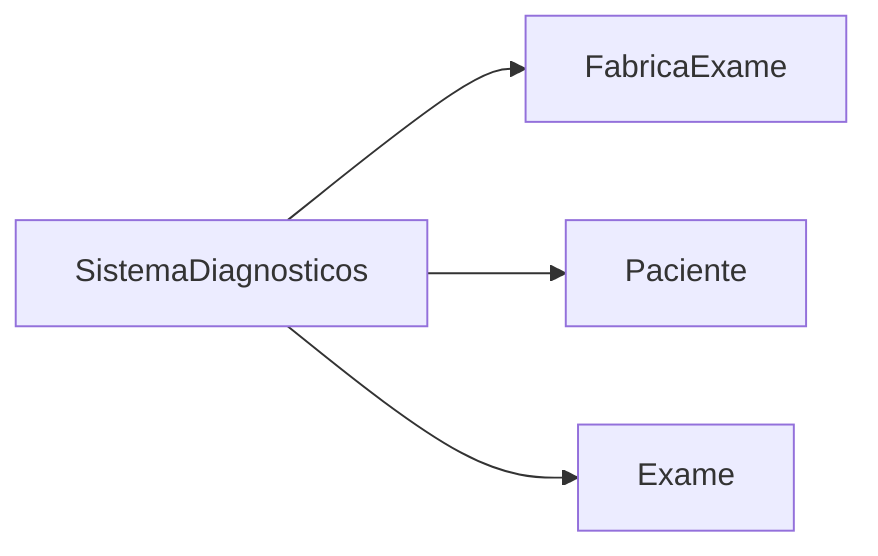
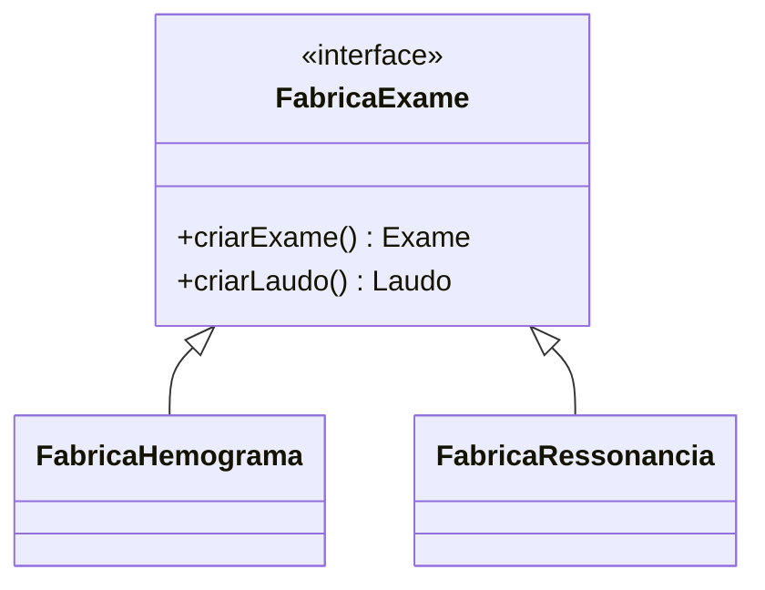
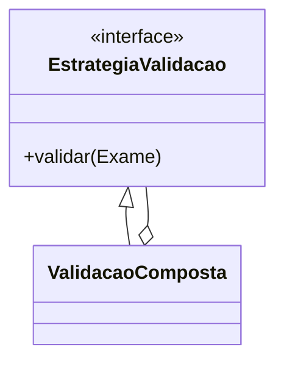
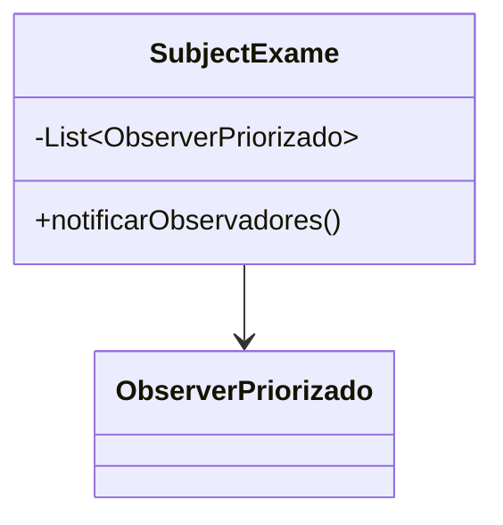
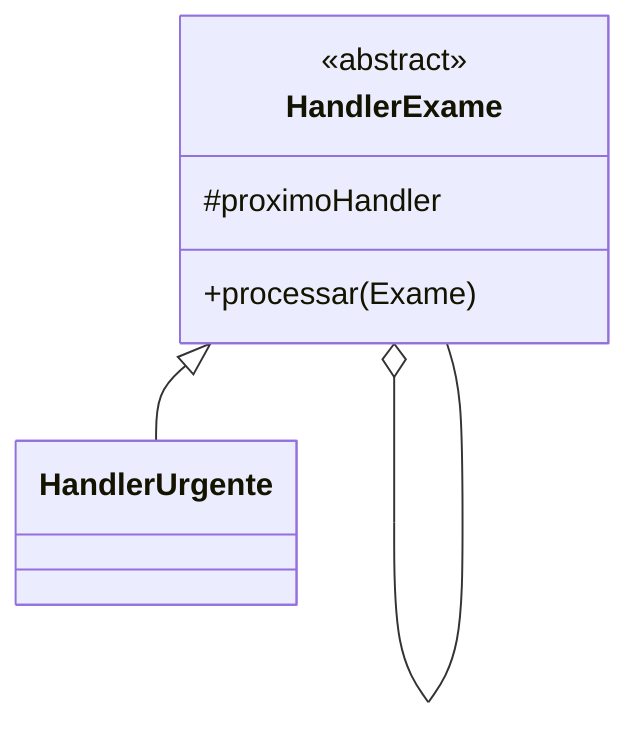
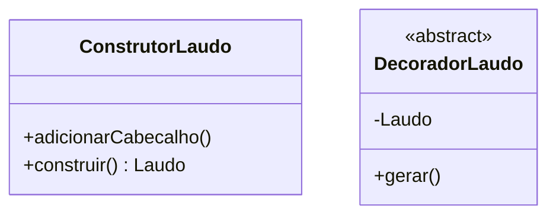
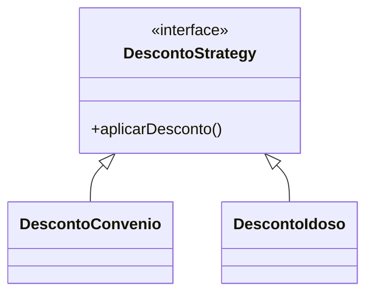

# Padrões de Projeto no Sistema de Diagnósticos

## 1. Classe Central: `SistemaDiagnosticos`

**Responsabilidade**: Orquestrar as principais operações do sistema de exames médicos.

### Métodos Principais
| Método | Descrição |
|--------|-----------|
| `+main(args: String[]): void` | Ponto de entrada do sistema |
| `+agendarExame(...): Exame` | Cria exames usando fábricas especializadas |
| `+calcularDesconto(...): double` | Aplica políticas de desconto |
| `+enviarNotificacao(...): void` | Gerencia notificações |

### Relações Chave


---

## 2. Fábrica Abstrata + Método Fábrica

**Problema Resolvido**: Criar famílias de objetos relacionados (exames + laudos) sem acoplamento.



**Benefícios**:
- Isola o código cliente das implementações concretas
- Facilita adição de novos tipos (ex: Tomografia)

---

## 3. Estratégia + Composite (Validação)

**Problema Resolvido**: Aplicar regras de validação flexíveis e combináveis.



**Caso de Uso**:
```java
ValidacaoExame validacaoRessonancia = new ValidacaoComposta(
    new ValidadorImplantes(),
    new ValidadorRadiologista()
);
```

---

## 4. Observer com Prioridade (Notificações)

**Problema Resolvido**: Notificar pacientes com priorização de emergências.



**Fluxo**:
1. Exame finalizado chama `notificarObservadores()`
2. Observadores são ordenados por prioridade
3. Notificações são disparadas (WhatsApp > Email)

---

## 5. Chain of Responsibility + Template Method

**Problema Resolvido**: Processar exames por prioridade.



**Lógica**:
```java
public void processar(Exame exame) {
    if (podeProcessar(exame)) {
        executarProcessamento(exame);
    } else if (proximo != null) {
        proximo.processar(exame);
    }
}
```

---

## 6. Decorator + Builder (Laudos)

**Problema Resolvido**: Construir laudos complexos com elementos opcionais.



**Uso**:
```java
Laudo laudo = new ConstrutorLaudo()
                .adicionarCabecalho()
                .adicionarDecorador(new DecoradorCarimbo())
                .construir();
```

---

## 7. Strategy (Descontos)

**Problema Resolvido**: Aplicar políticas de desconto flexíveis.



**Exemplo**:
```java
exame.calcularCusto(new DescontoConvenio()); // Aplica 15% de desconto
```

---

## Estrutura do Projeto

```
src/
├── main/
│   ├── fabricas/       # Padrão Factory
│   ├── estrategias/    # Validações e descontos
│   ├── observadores/   # Notificações
│   └── modelos/        # Entidades de domínio
```

**Vantagens**:

- Extensibilidade (novos exames/formatos)  
- Baixo acoplamento  
- Cobertura completa de requisitos  
